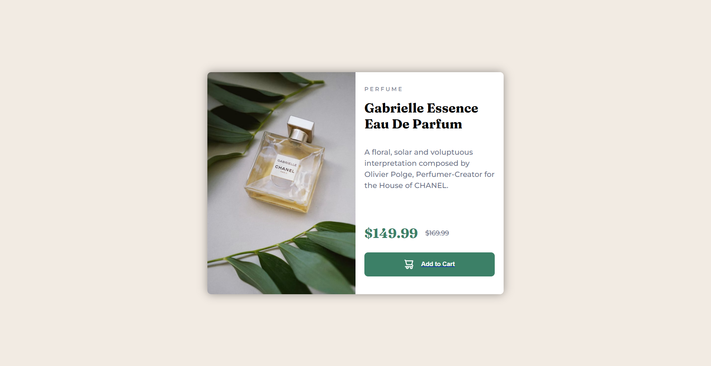

# Frontend Mentor - Product preview card component solution

This is my solution to the [Product preview card component challenge on Frontend Mentor](https://www.frontendmentor.io/challenges/product-preview-card-component-GO7UmttRfa). Frontend Mentor challenges help you improve your coding skills by building realistic projects.

## Table of contents

- [Overview](#overview)
  - [The challenge](#the-challenge)
  - [Screenshot](#screenshot)
  - [Links](#links)
- [My process](#my-process)
  - [Built with](#built-with)
  - [What I learned](#what-i-learned)
  - [Continued development](#continued-development)
  - [AI Collaboration](#ai-collaboration)
- [Author](#author)

## Overview

### The challenge

Users should be able to:

- View the optimal layout depending on their device's screen size
- See hover and focus states for interactive elements

### Screenshot



### Links

- Live Site URL: [Click here](https://zzzylo.github.io/Product-Preview/)

## My process

First, I built the HTML structure so the styling part would be easier later. Then I did the mobile layout for a long time, without touching media queries at all. It was hard figuring out a responsive layout before even adding breakpoints.

After that I worked on the image. I used a `<picture>` element with a `<source>` tag so it shows a different image depending on screen size, instead of forcing one image to look good everywhere.

Then I built the desktop media query. I didn't just use a common breakpoint like 768px, I resized my browser in Chrome DevTools and watched for the exact point where my mobile layout started looking cramped, then used that pixel value.

Making the image responsive took the most time out of everything. I kept forgetting what combination of properties I needed (width, aspect-ratio, object-fit) so I'd end up with a stretched image or random empty space I couldn't explain. After a lot of trial and error it finally clicked how these properties actually work together.

After the layout and image were done, I added a box shadow to the card and hover/focus states on the button to finish it off.

### Built with

- Semantic HTML5 markup
- CSS custom properties
- Flexbox
- CSS Grid
- Mobile-first workflow
- `<picture>` element for art-directed responsive images

### What I learned

I learned how to use aspect-ratio and object-fit together in order to maximize the responsiveness of my images.

```css
.wrapper picture img {
  display: block;
  max-width: 100%;
  margin: 0;
  aspect-ratio: 1 / 1.5;
  object-fit: cover;
}
```

Before this project I only knew about max-width: 100% for images, so I didn't understand why my images kept looking wrong on different screen sizes. Now I know aspect-ratio controls the shape of the image box, and object-fit: cover crops the actual image to fill that shape without stretching it. I also learned things like margin collapsing and when to let a container size itself based on its content instead of forcing a fixed height on it.

### Continued development

I'll keep on practicing responsive layout so I can improve. This is a huge challenge for me because as a newbie, being exposed to a lot of code for a long time makes me confused and scatters my thoughts. This project was a good opportunity for me to hone my debugging skills in this area.

### AI Collaboration

- I used Claude AI to brainstorm solutions for the problems I faced.
- I mostly asked it to explain why something was breaking instead of just asking for the fix, so I could actually understand concepts like grid vs flex behavior, margin collapsing, and how aspect-ratio and object-fit work together. It was hard but this project taught me a lot with the help of AI.

## Author

- Frontend Mentor - [@Zzzylo](https://www.frontendmentor.io/profile/Zzzylo)
- LinkedIn - [Zylo Lanard Vilarde](https://www.linkedin.com/in/zylo-lanard-vilarde-454aa5419/)
